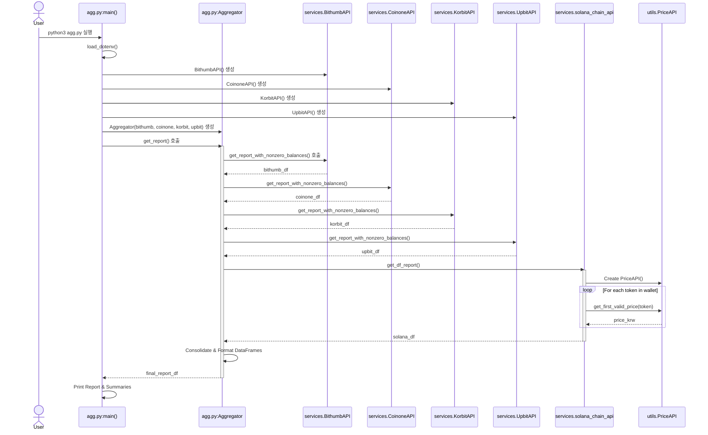

# 암호화폐 포트폴리오 애그리게이터

## 프로젝트 개요

이 프로젝트는 파이썬 기반의 암호화폐 포트폴리오 애그리게이터입니다. 여러 한국 거래소와 Solana Phantom 지갑의 암호화폐 보유량을 수집하고, 현재 KRW 기준 가치를 계산하여 통합 보고서를 제공합니다. 또한 수동으로 입력한 자산 수량을 기반으로 가치를 추적할 수 있는 유틸리티도 함께 제공합니다.

## 주요 기능

*   **다중 거래소 지원:** 주요 국내 거래소의 잔고를 통합 관리합니다:
    *   빗썸
    *   코인원
    *   코빗
    *   업비트
*   **솔라나 지갑 통합:** 지정된 Solana(Phantom) 지갑 주소의 SOL 및 SPL 토큰 잔고를 조회합니다.
*   **KRW 평가:** 거래소 가격과 CoinGecko를 포함한 여러 소스의 가격을 우선순위에 따라 조회하여 모든 자산의 현재 KRW 가치를 자동으로 계산합니다.
*   **통합 보고서:** 모든 소스의 데이터를 Pandas DataFrame으로 통합하여 개별 자산, 수량, 현재가, 총액, 거래소/소스 정보를 한눈에 확인할 수 있습니다.
*   **수동 추적:** 환경 설정(`manually_with_env.py`)에서 수동으로 정의한 자산 수량을 기반으로 포트폴리오 가치를 계산할 수 있습니다.
*   **자동 모니터링:** 주기적으로 자산을 집계하는 셸 스크립트(`monitoring.sh`)를 포함하고 있습니다.
*   **모듈화된 설계:** API 연동을 위한 `services`와 가격 조회와 같은 공통 유틸리티를 위한 `utils`로 코드가 구조화되어 있습니다.

## 디렉토리 구조

```
.
├── README.md                 # 이 문서
├── agg.py                    # 실시간 포트폴리오 집계를 위한 메인 스크립트
├── manually_with_env.py      # 수동으로 입력한 보유량을 추적하기 위한 스크립트
├── monitoring.sh             # agg.py를 주기적으로 실행하는 셸 스크립트
├── requirements.txt          # 파이썬 패키지 의존성
├── .env                      # 환경 변수 (사용자가 생성해야 함)
├── services/                 # 외부 서비스와 상호작용하기 위한 모듈
│   ├── __init__.py
│   ├── bithumb_api.py
│   ├── coinone_api.py
│   ├── korbit_api.py
│   ├── solana_chain_api.py
│   └── upbit_api.py
└── utils/                    # 유틸리티 모듈
    ├── __init__.py
    └── price_fetcher.py
```
*(참고: `cex_agg.py`와 `dex_sol_agg.py`도 사용자 요청에 따라 저장소에 존재하지만, 여기서 설명하는 기본 워크플로우에는 포함되지 않습니다.)*

## 핵심 기능

### 1. 실시간 포트폴리오 집계 (`agg.py`)

실시간 암호화폐 포트폴리오를 추적하기 위한 메인 스크립트입니다.
*   빗썸, 코인원, 코빗, 업비트, 솔라나 블록체인을 위한 API 클라이언트를 초기화합니다.
*   이 플랫폼들에 보유한 모든 자산의 잔고를 조회합니다.
*   솔라나 자산의 경우 KRW 가치를 얻기 위해 `utils.price_fetcher.PriceAPI`를 사용합니다. 거래소 API는 일반적으로 직접 KRW 가격을 제공합니다.
*   모든 데이터는 표준화되어 단일 보고서로 결합되며, 다음 정보를 보여줍니다:
    *   자산 이름 (예: BTC, SOL, USDC)
    *   보유 수량
    *   현재가 (KRW)
    *   총액 (KRW)
    *   거래소/소스 (예: 업비트, 팬텀)
    *   데이터 조회 시각
*   이 스크립트는 또한 자산 이름별 및 거래소별로 그룹화된 총 포트폴리오 가치와 보유량에 대한 요약도 출력합니다.

### 2. 수동 포트폴리오 추적 (`manually_with_env.py`)

`.env` 파일에 수동으로 정의한 수량을 기반으로 포트폴리오 가치를 계산할 수 있는 스크립트입니다.
*   `.env` 파일에서 `CRYPTO_<심볼>` 변수를 읽어옵니다 (예: `CRYPTO_BTC=1.5`).
*   `utils.price_fetcher.PriceAPI`를 사용하여 정의된 각 자산의 현재 KRW 가격을 가져옵니다.
*   그런 다음 수동으로 추적되는 보유 자산의 가치를 보여주는 보고서를 출력합니다.
*   **참고:** 이 스크립트는 거래소나 실제 지갑에 연결하지 않으며, `.env`에 지정한 수량만 사용합니다.

### 3. 서비스 모듈 (`services/`)

이 디렉토리에는 각 금융 서비스와 통신을 담당하는 파이썬 모듈이 포함되어 있습니다:
*   `bithumb_api.py`: 빗썸 거래소 API와의 상호작용을 처리합니다.
*   `coinone_api.py`: 코인원 거래소 API와의 상호작용을 처리합니다.
*   `korbit_api.py`: 코빗 거래소 API와의 상호작용을 처리합니다.
*   `upbit_api.py`: 업비트 거래소 API와의 상호작용을 처리합니다.
*   `solana_chain_api.py`: RPC를 통해 솔라나 블록체인과 상호작용하여 지갑 잔고(SOL 및 SPL 토큰)를 가져옵니다. 토큰 평가를 위해 `utils.price_fetcher.py`를 활용합니다.

Each module typically manages its own authentication, API request logic, and formats the retrieved data into a Pandas DataFrame.

### 4. 유틸리티 모듈 (`utils/`)

*   `price_fetcher.py`: `PriceAPI` 클래스를 포함하고 있습니다. 이 유틸리티는 주어진 암호화폐 심볼의 KRW 가격을 조회하는 역할을 합니다. 업비트, 빗썸, 코인원, 그리고 CoinGecko(대체 수단으로)에 우선순위에 따라 조회하여 사용 가능한 첫 번째 유효한 가격을 찾습니다.

## 개발 환경 및 설정

### 필수 조건
*   Python 3 (예: Python 3.8 이상)
*   `.sh` 스크립트를 실행하기 위한 셸 환경(예: bash) 접근 권한

### 1. 저장소 복제 (해당하는 경우)
```bash
git clone <repository_url>
cd <repository_directory>
```

### 2. `.env` 파일 생성
프로젝트 루트 디렉토리에 반드시 `.env` 파일을 생성해야 합니다. 이 파일은 API 키와 기타 민감한 설정을 저장합니다.

아래 예시를 복사하고 자격 증명 및 정보로 플레이스홀더 값을 대체하세요:

```env
# 거래소 API 키
UPBIT_ACCESS_KEY="your_upbit_access_key"
UPBIT_SECRET_KEY="your_upbit_secret_key"

KORBIT_ACCESS_KEY="your_korbit_access_key"
KORBIT_SECRET_KEY="your_korbit_secret_key"

BITHUMB_ACCESS_KEY="your_bithumb_access_key"
BITHUMB_SECRET_KEY="your_bithumb_secret_key"

COINONE_ACCESS_KEY="your_coinone_access_key"
COINONE_SECRET_KEY="your_coinone_secret_key"

# 솔라나 팬텀 지갑 주소 (또는 솔라나 주소)
PHANTOM_SOLANA_ACCOUNT="your_phantom_solana_wallet_address"

# 선택사항: manually_with_env.py를 위한 수동 추적 암호화폐 보유량
# 다음 형식으로 추적하려는 자산을 정의하세요:
# CRYPTO_심볼=수량
# 예시:
# CRYPTO_BTC="1.5"
# CRYPTO_ETH="10.25"
# CRYPTO_USDC="1000"
```
**중요:** `.env` 파일을 안전하게 보관하고 버전 관리 시스템에 커밋하지 마세요. 아직 추가하지 않았다면 `.gitignore` 파일에 `.env`를 추가하세요.

### 3. 의존성 설치
이 프로젝트는 여러 파이썬 패키지를 사용합니다. 제공된 `requirements.txt` 파일을 사용하여 pip로 설치할 수 있습니다.

```bash
pip install -r requirements.txt
```
`requirements.txt`가 아직 없거나 수동으로 설치를 선호하는 경우, 핵심 의존성은 다음과 같습니다:
```bash
pip install python-dotenv pandas requests PyJWT solana solders
```

## 실행 방법

### 1. 실시간 포트폴리오 집계 (`agg.py`)
거래소와 솔라나 지갑의 통합 포트폴리오를 확인하려면 메인 집계 스크립트를 실행하세요:
```bash
python3 agg.py
```
스크립트는 결과를 콘솔에 출력합니다.

### 2. 자동 모니터링 (`monitoring.sh`)
`monitoring.sh` 스크립트는 `agg.py`를 주기적으로 실행합니다(기본값: 3분마다).
먼저 스크립트에 실행 권한을 부여하세요:
```bash
chmod +x monitoring.sh
```
그런 다음 실행하세요:
```bash
./monitoring.sh
```
활동이 콘솔에 기록됩니다. 중지하려면 `Ctrl+C`를 누르세요.

### 3. 수동 포트폴리오 추적 (`manually_with_env.py`)
`.env` 파일에 수동으로 지정한 수량을 기반으로 포트폴리오 가치를 계산하려면:
```bash
python3 manually_with_env.py
```

## 사용된 주요 패키지

*   **python-dotenv:** `.env` 파일에서 환경 변수를 로드하기 위한 라이브러리입니다.
*   **pandas:** 데이터 조작 및 보고서 구조화를 위한 DataFrame 생성을 위한 라이브러리입니다.
*   **requests:** 외부 거래소 API 및 RPC 엔드포인트에 HTTP 요청을 보내기 위한 라이브러리입니다.
*   **PyJWT:** 일부 거래소(예: 빗썸)와의 인증에 사용되는 JSON 웹 토큰 생성을 위한 라이브러리입니다.
*   **solana:** 솔라나 블록체인과 상호작용하기 위한 공식 파이썬 클라이언트 라이브러리입니다.
*   **solders:** `solana-py`를 위한 동반 라이브러리로, 핵심 솔라나 데이터 구조와 유틸리티를 제공합니다.

## 함수 호출 관계 (`agg.py` 워크플로우)

다음 다이어그램은 `agg.py`가 실행될 때의 일반적인 호출 흐름을 보여줍니다:



---
This README provides a comprehensive guide to understanding, setting up, and using the cryptocurrency portfolio aggregator.
