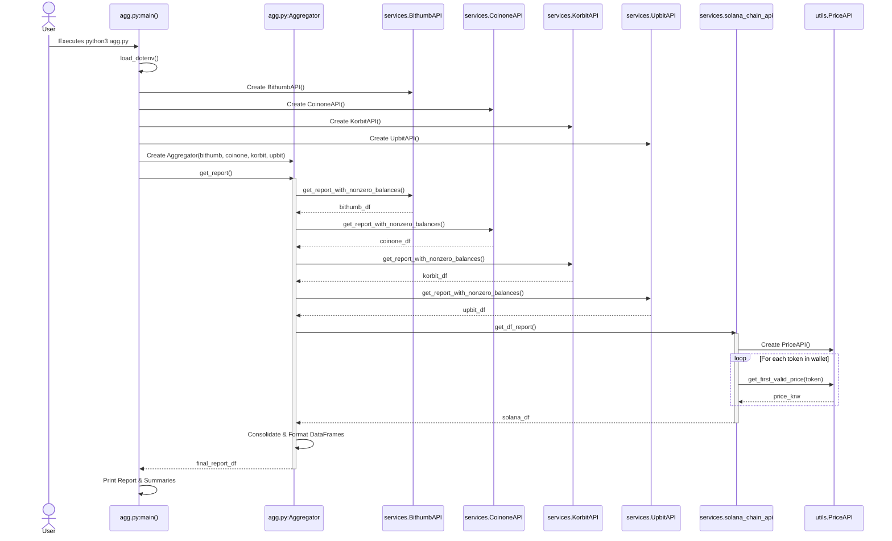

# Cryptocurrency Portfolio Aggregator

## Project Overview

This project is a Python-based cryptocurrency portfolio aggregator. It gathers your cryptocurrency holdings from various Korean exchanges and a Solana Phantom wallet, determines their current value in KRW, and presents a consolidated report. It also offers a separate utility to track asset values based on manually entered quantities.

## Features

*   **Multi-Exchange Support:** Aggregates balances from major Korean exchanges:
    *   Bithumb
    *   Coinone
    *   Korbit
    *   Upbit
*   **Solana Wallet Integration:** Fetches SOL and SPL token balances from a specified Solana (Phantom) wallet address.
*   **KRW Valuation:** Automatically fetches current KRW prices for all assets using a combination of direct exchange prices and a fallback mechanism querying multiple sources (including CoinGecko).
*   **Consolidated Reporting:** Merges data from all sources into a unified Pandas DataFrame, showing individual assets, quantities, current prices, total values, and the exchange/source.
*   **Manual Tracking:** Option to calculate portfolio value based on asset quantities manually defined in the environment settings (`manually_with_env.py`).
*   **Automated Monitoring:** Includes a shell script (`monitoring.sh`) to run the aggregation periodically.
*   **Modular Design:** Code is structured into `services` for API interactions and `utils` for shared utilities like price fetching.

## Directory Structure

```
.
├── README.md                 # This documentation file
├── agg.py                    # Main script for live portfolio aggregation
├── manually_with_env.py      # Script for tracking manually entered holdings
├── monitoring.sh             # Shell script for periodic execution of agg.py
├── requirements.txt          # Python package dependencies
├── .env                      # Environment variables (user must create this)
├── services/                 # Modules for interacting with external services
│   ├── __init__.py
│   ├── bithumb_api.py
│   ├── coinone_api.py
│   ├── korbit_api.py
│   ├── solana_chain_api.py
│   └── upbit_api.py
└── utils/                    # Utility modules
    ├── __init__.py
    └── price_fetcher.py
```
*(Note: `cex_agg.py` and `dex_sol_agg.py` also exist in the repository as per user request but are not part of the primary workflow described here.)*

## Core Functionality

### 1. Live Portfolio Aggregation (`agg.py`)

This is the main script for tracking your live cryptocurrency portfolio.
*   It initializes API clients for Bithumb, Coinone, Korbit, Upbit, and the Solana blockchain.
*   It fetches balances for all assets held on these platforms.
*   For Solana assets, it uses the `utils.price_fetcher.PriceAPI` to get KRW values. Exchange APIs typically provide KRW prices directly.
*   All data is standardized and combined into a single report, showing:
    *   Asset Name (e.g., BTC, SOL, USDC)
    *   Quantity Held
    *   Current Price (KRW)
    *   Total Value (KRW)
    *   Exchange/Source (e.g., Upbit, Phantom)
    *   Timestamp of data retrieval
*   The script also prints summaries of total portfolio value and holdings grouped by asset name and by exchange.

### 2. Manual Portfolio Tracking (`manually_with_env.py`)

This script allows you to calculate the value of a portfolio based on quantities you manually define in your `.env` file.
*   It reads `CRYPTO_<SYMBOL>` variables from your `.env` file (e.g., `CRYPTO_BTC=1.5`).
*   It uses `utils.price_fetcher.PriceAPI` to get the current KRW price for each defined asset.
*   It then prints a report showing the value of these manually tracked holdings.
*   **Note:** This script does *not* connect to exchanges or your live wallet; it only uses the quantities you specify in `.env`.

### 3. Service Modules (`services/`)

This directory contains the Python modules responsible for communicating with each specific financial service:
*   `bithumb_api.py`: Handles interactions with the Bithumb exchange API.
*   `coinone_api.py`: Handles interactions with the Coinone exchange API.
*   `korbit_api.py`: Handles interactions with the Korbit exchange API.
*   `upbit_api.py`: Handles interactions with the Upbit exchange API.
*   `solana_chain_api.py`: Handles interactions with the Solana blockchain via RPC to fetch wallet balances (SOL and SPL tokens). It utilizes `utils.price_fetcher.py` for token valuation.

Each module typically manages its own authentication, API request logic, and formats the retrieved data into a Pandas DataFrame.

### 4. Utility Modules (`utils/`)

*   `price_fetcher.py`: Contains the `PriceAPI` class. This utility is responsible for fetching the KRW price of a given cryptocurrency symbol. It queries Upbit, Bithumb, Coinone, and CoinGecko (as a fallback) in a prioritized manner to find the first available valid price.

## Development Environment & Setup

### Prerequisites
*   Python 3 (e.g., Python 3.8+)
*   Access to a shell environment (like bash) for running `.sh` scripts.

### 1. Clone the Repository (if applicable)
```bash
git clone <repository_url>
cd <repository_directory>
```

### 2. Create `.env` File
You **must** create a file named `.env` in the root directory of the project. This file stores your API keys and other sensitive configuration.

Copy the example below and replace the placeholder values with your actual credentials and information:

```env
# Exchange API Keys
UPBIT_ACCESS_KEY="your_upbit_access_key"
UPBIT_SECRET_KEY="your_upbit_secret_key"

KORBIT_ACCESS_KEY="your_korbit_access_key"
KORBIT_SECRET_KEY="your_korbit_secret_key"

BITHUMB_ACCESS_KEY="your_bithumb_access_key"
BITHUMB_SECRET_KEY="your_bithumb_secret_key"

COINONE_ACCESS_KEY="your_coinone_access_key"
COINONE_SECRET_KEY="your_coinone_secret_key"

# Solana Phantom Wallet Address (or any Solana address)
PHANTOM_SOLANA_ACCOUNT="your_phantom_solana_wallet_address"

# Optional: For manually_with_env.py - Manually Tracked Crypto Holdings
# Define any assets you want to track manually using this format:
# CRYPTO_SYMBOL=QUANTITY
# Examples:
# CRYPTO_BTC="1.5"
# CRYPTO_ETH="10.25"
# CRYPTO_USDC="1000"
```
**Important:** Keep your `.env` file secure and do not commit it to version control. Add `.env` to your `.gitignore` file if it's not already there.

### 3. Install Dependencies
The project uses several Python packages. You can install them using pip and the provided `requirements.txt` file.

```bash
pip install -r requirements.txt
```
If `requirements.txt` is not yet available or you prefer manual installation for some reason, the core dependencies are:
```bash
pip install python-dotenv pandas requests PyJWT solana solders
```

## How to Run

### 1. Live Portfolio Aggregation (`agg.py`)
To run the main aggregation script and see your consolidated portfolio from exchanges and your Solana wallet:
```bash
python3 agg.py
```
The script will output the results to the console.

### 2. Automated Monitoring (`monitoring.sh`)
The `monitoring.sh` script runs `agg.py` periodically (every 3 minutes by default).
First, make the script executable:
```bash
chmod +x monitoring.sh
```
Then, run it:
```bash
./monitoring.sh
```
It will log its activity to the console. Press `Ctrl+C` to stop it.

### 3. Manual Portfolio Tracking (`manually_with_env.py`)
To calculate portfolio values based on quantities manually specified in your `.env` file:
```bash
python3 manually_with_env.py
```

## Key Packages Used

*   **python-dotenv:** For loading environment variables from the `.env` file.
*   **pandas:** For data manipulation and creating DataFrames to structure reports.
*   **requests:** For making HTTP requests to external exchange APIs and RPC endpoints.
*   **PyJWT:** For generating JSON Web Tokens, used for authentication with some exchanges (e.g., Bithumb).
*   **solana:** The official Python client library for interacting with the Solana blockchain.
*   **solders:** A companion library for `solana-py`, providing core Solana data structures and utilities.

## Function Call Relationship (`agg.py` Workflow)

The following diagram illustrates the typical call flow when `agg.py` is executed:



---
This README provides a comprehensive guide to understanding, setting up, and using the cryptocurrency portfolio aggregator.
